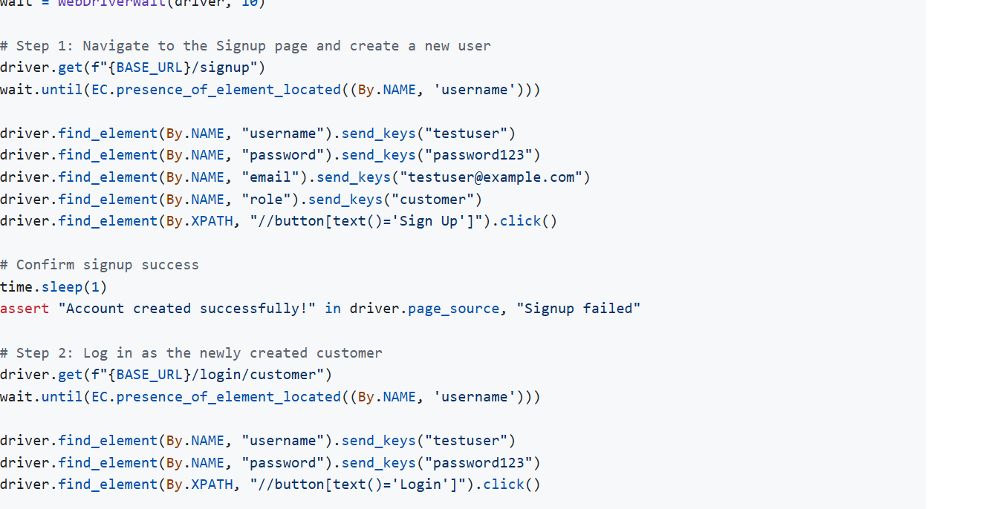
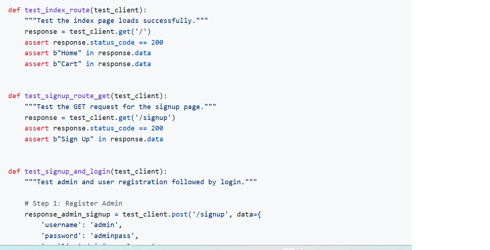
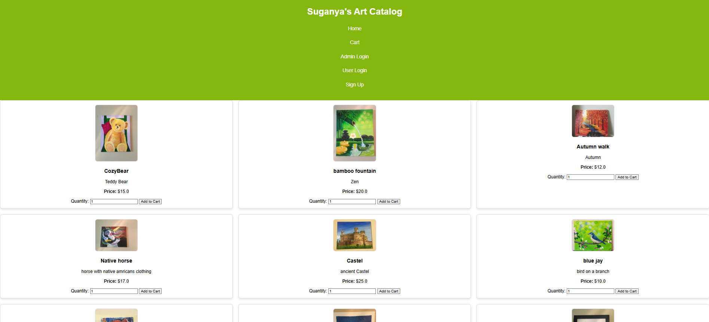
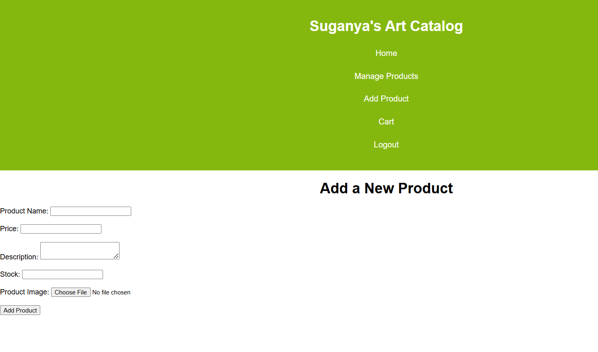
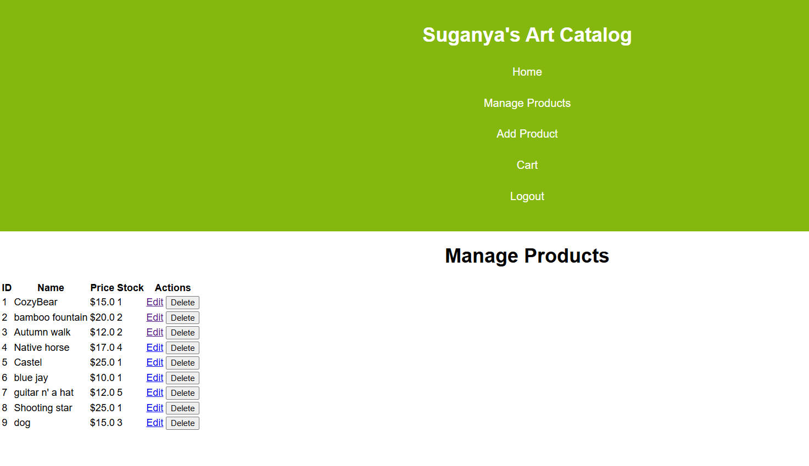

# E-Commerce Web Application

## Overview
This project is a simple e-commerce web application built with Flask, SQLAlchemy, and Bootstrap, providing a responsive and dynamic user interface. It features an intuitive product catalog, secure user authentication, an interactive shopping cart, and an admin panel for managing products and orders. The app is tested using Selenium Webdriver, unittest and pytest.

## Key Features & Flask Components

### Product Catalog Display
- The homepage displays a product catalog with images, descriptions, and prices.
- Products are retrieved from the database using SQLAlchemy and displayed in a responsive grid layout using Bootstrap.
- Each product has an "Add to Cart" option, allowing customers to specify quantities and add products to their cart.

### User Authentication
- Users can log in as either **admin** or **customer**, with different views and access permissions for each role.
- User credentials are stored securely using password hashing (Werkzeug).
- Flask sessions manage login states and user sessions.

### Admin Panel for Product Management
- Admin users can add, edit, and delete products.
- Admin-specific routes are protected with the `admin_required` decorator to restrict access.
- Admins can manage product details, including uploading product images and updating inventory.

### Shopping Cart Functionality
- Users can add products to the cart, with quantity and total cost details displayed.
- The cart is stored in the user's session, allowing them to continue shopping or proceed to checkout.

### Checkout & Order Processing
- The checkout page allows users to review their cart and make payments using a mock payment processor.
- Upon successful payment, order details are saved to the database as an order record.
- Users receive a confirmation message upon successful order submission.

### Product Image Upload
- Admins can upload product images, which are saved to the server and associated with the respective products.
- Images are served from the `/static/uploads/` folder and displayed alongside product details.

### Responsive Design
- The app is responsive, with product images displayed in a grid layout that adjusts according to screen size.
- Bootstrap is used to ensure a consistent and mobile-friendly UI.

### Error Handling & Flash Messages
- The application provides feedback using flash messages for successful actions (e.g., adding products, successful login) and errors (e.g., invalid login credentials, insufficient stock).
- Custom error pages handle 404 errors gracefully.

### Database Integration (SQLAlchemy)
- SQLAlchemy is used for managing and querying the database, including tables for `Product`, `User`, and `Order`.
- Relationships between products and orders are managed using foreign keys.

### File Upload Management
- Supports uploading and validating images with allowed extensions like PNG, JPG, and JPEG.
- Product images are stored in a dedicated folder (`static/uploads/`) and served dynamically using Flask’s `url_for()` function.

## Technologies Used
- **Flask** for the web framework
- **SQLAlchemy** for database interaction
- **Jinja2** for templating engine
- **Werkzeug** for secure password handling
- **Bootstrap** for frontend styling
- **Flask-SQLAlchemy** for managing database models


To provide an overview of key parts of the e-commerce application, here are a few essential code snippets that demonstrate critical features like product management, user authentication, shopping cart handling, and the admin dashboard.


# 1. User Authentication (login route)
```python
from flask import Flask, render_template, redirect, url_for, flash, session
from werkzeug.security import check_password_hash

@app.route('/login', methods=['GET', 'POST'])
def login():
    if request.method == 'POST':
        username = request.form['username']
        password = request.form['password']
        user = User.query.filter_by(username=username).first()

        if user and check_password_hash(user.password, password):
            session['user_id'] = user.id
            session['is_admin'] = user.is_admin
            flash("Login successful!", "success")
            return redirect(url_for('admin_dashboard') if user.is_admin else url_for('catalog'))
        else:
            flash("Invalid username or password", "danger")
    return render_template('login.html')

# 2. Admin Product Management (Add, Edit, Delete Product)
@app.route('/admin/add_product', methods=['GET', 'POST'])
@admin_required  # Custom decorator to restrict access to admins
def add_product():
    if request.method == 'POST':
        name = request.form['name']
        price = float(request.form['price'])
        description = request.form['description']
        image = request.files['image']
        
        # Save image and add product to the database
        if image:
            image_path = save_image(image)
            new_product = Product(name=name, price=price, description=description, image_path=image_path)
            db.session.add(new_product)
            db.session.commit()
            flash('Product added successfully!', 'success')
            return redirect(url_for('admin_dashboard'))
    return render_template('admin/add_product.html')

# 3. Shopping Cart Management
@app.route('/add_to_cart/<int:product_id>', methods=['POST'])
@login_required
def add_to_cart(product_id):
    quantity = int(request.form['quantity'])
    cart = session.get('cart', {})
    cart[product_id] = cart.get(product_id, 0) + quantity
    session['cart'] = cart
    flash("Product added to cart!", "success")
    return redirect(url_for('cart'))

@app.route('/cart')
def cart():
    cart = session.get('cart', {})
    products = Product.query.filter(Product.id.in_(cart.keys())).all()
    total = sum(product.price * quantity for product, quantity in zip(products, cart.values()))
    return render_template('cart.html', products=products, total=total)

# 4. Checkout and Order Processing
@app.route('/checkout', methods=['GET', 'POST'])
@login_required
def checkout():
    if request.method == 'POST':
        cart = session.get('cart', {})
        order = Order(user_id=session['user_id'])
        
        for product_id, quantity in cart.items():
            product = Product.query.get(product_id)
            order_item = OrderItem(order=order, product=product, quantity=quantity)
            db.session.add(order_item)
        
        db.session.add(order)
        db.session.commit()
        
        # Clear the cart after order submission
        session.pop('cart', None)
        flash("Order placed successfully!", "success")
        return redirect(url_for('catalog'))
    return render_template('checkout.html')

# 5. Admin Dashboard with Product Management Links
@app.route('/admin_dashboard')
@admin_required
def admin_dashboard():
    products = Product.query.all()
    orders = Order.query.all()
    return render_template('admin/dashboard.html', products=products, orders=orders)
```
## Explanation of Key Components
- **User Authentication**: Uses session management to track login states, with password security handled by Werkzeug’s hashing functions.
- **Admin Product Management**: Allows the admin to add, edit, and delete products via custom routes, with role-restricted access controlled by a custom @admin_required decorator.
- **Shopping Cart Management**: Manages the cart contents within the session, ensuring that products and quantities persist as users navigate.
- **Checkout and Order Processing**: Creates an order record with associated items in the database and clears the cart session upon successful order placement.
- **Admin Dashboard**: Displays product and order details with links for admins to edit or delete products, providing a central control hub for management tasks.

## Demonstration and Access
The application can be hosted on a live server (e.g., **Heroku**, **AWS**, or local deployment), where users can register, log in, browse products, manage the shopping cart, and complete purchases.

## Future Enhancements

1. **User Profiles and Order History**
   - Enable users to create detailed profiles, track past orders, and view order history.
   - Allow for address management and saved payment methods for quicker checkout.

2. **Enhanced Admin Dashboard**
   - Include sales analytics, product performance insights, and customer demographics.
   - Implement bulk product upload capabilities for easier inventory management.

3. **Product Reviews and Ratings**
   - Allow customers to leave reviews and ratings for purchased products.
   - Display average ratings and review counts on product pages to improve customer trust.

4. **Advanced Search and Filtering**
   - Introduce a robust search feature with filters for categories, price range, ratings, and brands.
   - Include auto-suggestions and sorting options (e.g., price, popularity) for better user experience.

5. **Wishlist and Save for Later**
   - Allow users to add products to a wishlist or save items for future purchase.
   - Notify users of price changes or availability for wishlist items.

## **Summary of E-Commerce App Testing**  

### **1. Testing Approach**  
**Flask-based e-commerce application** was tested using:  
- **Selenium WebDriver** – For UI and functional testing.  
- **unittest & pytest** – For backend and API testing.  

### **2. Selenium WebDriver Testing**  
Used for **UI testing and user interactions**, including:  
-  **Login & Authentication** – Verified user and admin logins.  
-  **Product Catalog** – Checked product display and details page.  
-  **Shopping Cart** – Ensured add-to-cart functionality works.  
-  **Checkout Process** – Tested checkout page and order placement.  
-  **Admin Panel** – Verified product addition, editing, and deletion.  

### **3. Pytest & Unittest for Backend Testing**  
-  **Database Operations** – Ensured `db.session.add()` and queries work within `app_context()`.  
-  **Flask Routes & API Testing** – Verified responses from key routes.  
-  **User Registration & Authentication** – Checked sign-up, login, and session management.  
-  **Cart & Order Processing** – Ensured correct item addition and checkout flow.  

### **4. Next Steps**  
🔹 **Improve Error Handling** – Add better validation messages in UI tests.  
🔹 **Expand Test Coverage** – Include edge cases (e.g., invalid product quantity).  

 


## Screenshots




