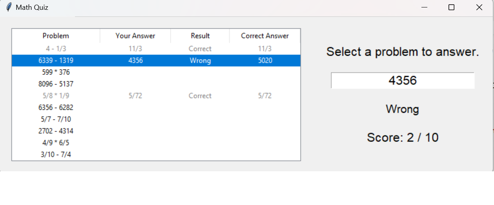

# Math Quiz Application

The Math Quiz Application is a Python-based educational program that generates random math problems for users to solve. The app includes a graphical interface created with Tkinter and supports multiple types of problems, including integer and fraction operations. The user can select the number of questions, answer them interactively, and receive real-time feedback with a final score at the end.

## Features
- **Random Problem Generation**: Problems include four-digit addition, four-digit subtraction, three-digit multiplication, and fraction addition, subtraction, and multiplication.
- **Interactive Table Display**: Problems are displayed in a table format with columns for "Problem," "Your Answer," "Result," and "Correct Answer."
- **Real-Time Feedback**: Users get immediate feedback on each answer, and results are displayed in the table.
- **Score Tracking**: A score label updates dynamically as the user answers each problem.
- **Final Quiz Completion Message**: Displays a congratulatory message when the quiz is complete.

## Screenshots
### Problem Display and Answer Entry



## Code Structure
- `MathQuizApp`: The main class for the application, responsible for generating problems, displaying the interface, handling answer checks, and updating scores.
- **Problem Generation**: Randomly generates math problems, including fractions and integers.
- **User Feedback and Validation**: Displays real-time feedback for user answers, including handling for invalid inputs.

## Code Snippets
### Initialization and Main Interface
```python
class MathQuizApp:
    def __init__(self, root):
        self.root = root
        self.root.title("Math Quiz")
        self.num_problems = simpledialog.askinteger("Number of Questions", "How many questions would you like?", minvalue=1, maxvalue=10)
        if not self.num_problems:
            self.num_problems = 5
        self.problems = []
        self.correct_count = 0
        self.generate_problems()

### Problem Generation
def generate_problems(self):
    """Generate a list of math problems."""
    for _ in range(self.num_problems):
        problem_type = random.choice(["addition", "subtraction", "multiplication", "fraction_add", "fraction_sub", "fraction_mult"])
        # Problem generation logic (example for addition):
        if problem_type == "addition":
            num1, num2 = random.randint(1000, 9999), random.randint(1000, 9999)
            answer = num1 + num2
            problem_text = f"{num1} + {num2}"
        self.problems.append((problem_text, answer))

### Answer Validation
def check_answer(self, event=None):
    """Check the user's answer for the selected problem."""
    if self.selected_problem_index is None:
        self.feedback_label.config(text="Please select a problem first.")
        return

    user_answer = self.answer_entry.get()
    try:
        correct_answer = self.problems[self.selected_problem_index][1]
        if isinstance(correct_answer, fractions.Fraction):
            user_answer = fractions.Fraction(user_answer)
        else:
            user_answer = int(user_answer)

        if user_answer == correct_answer:
            result_text = "Correct"
            self.correct_count += 1
            self.problem_table.set(self.selected_problem_index, "Result", "Correct")
        else:
            result_text = "Wrong"
            self.problem_table.set(self.selected_problem_index, "Result", "Wrong")

### Requirements
Python 3.7+
Tkinter (standard with Python installations)
fractions module (standard with Python installations)


### Technologies Used
Python: Core programming language used
Tkinter: GUI library for displaying the quiz interface
fractions: Used for handling fraction operations and user answers
