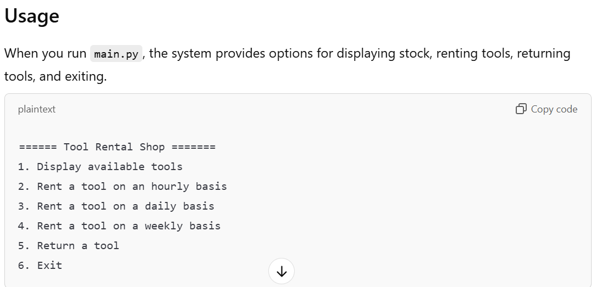
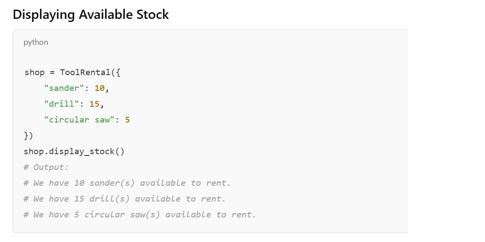
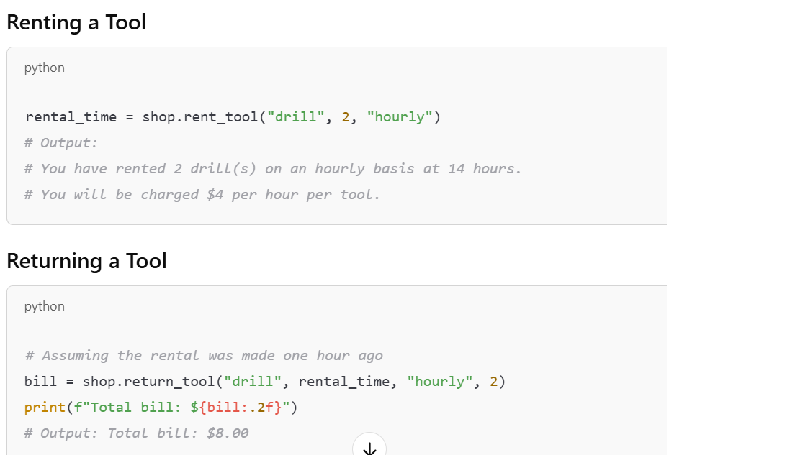
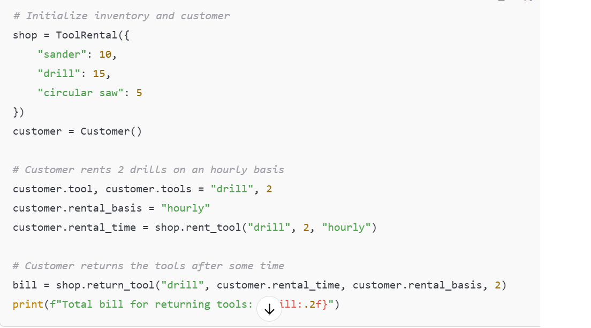

## Tool Rental System
A Python-based tool rental system that enables customers to rent tools on an hourly, daily, or weekly basis, manage inventory, and calculate rental fees. Built with object-oriented programming principles, this project includes features for tracking rentals, handling returns, and calculating bills based on rental duration. It demonstrates the power of OOP principles, such as encapsulation, inheritance, and modular design, to create a scalable and maintainable codebase.

## Purpose
The main goal of this project is to highlight how OOP can enhance code organization, reusability, and extensibility in real-world applications. By using classes and objects, the Tool Rental System maintains clean code, efficiently manages tool inventories, and simplifies complex processes such as rental tracking and cost calculation.

## Features
- **Tool Inventory Management**: Uses OOP to encapsulate tool properties and availability within a Tool class, keeping inventory organized and easy to update.
- **Customer Rental Tracking**: The Rental class stores customer rental information, ensuring clear separation of concerns and straightforward rental processing.
- **Cost Calculation**: Modular calculation methods within classes allow for flexible and accurate rental cost determination based on rental duration and tool type.
- **Rental History**: Maintains an organized log of all rental transactions, leveraging OOP to store and retrieve rental details.


## Code Structure
- **ToolRentalSystem**: The main class for the application, handling tool inventory, rental management, and cost calculation.
- **Inventory Management**: Adds tools to the inventory and tracks their availability status.
- **Rental Processing**: Records customer rentals, calculates rental fees based on duration, and updates tool status.
- **Cost Calculation and Rental History**: Tracks total cost for each rental and maintains a log of all transactions for easy access.

## Classes and Methods
- **Rental Class**: Manages tool stock display.
display_stock: Shows available tools and quantities in stock.
- **ToolRental Class**: Handles rental operations (hourly, daily, weekly) and billing.
rent_tool(tool, n, basis): Rents a specified quantity of tools on the chosen basis (hourly, daily, weekly).
return_tool(tool, rental_time, rental_basis, n): Calculates the bill based on rental duration and replenishes stock.
- **Customer Class**: Manages customer actions.
request_tool: Gathers rental tool type and quantity from the customer.
choose_rental_basis: Allows the customer to choose the rental basis.
return_tool: Facilitates the return process.

## Code Snippets
## Initialization and Main Functionalities
```python
class ToolRentalSystem:
    def __init__(self):
        self.inventory = {}
        self.rental_history = []
    
    def add_tool(self, tool_name, tool_type, daily_rate):
        self.inventory[tool_name] = {
            "type": tool_type,
            "daily_rate": daily_rate,
            "is_available": True
        }
    
    def rent_tool(self, tool_name, customer_name, rental_days):
        if tool_name in self.inventory and self.inventory[tool_name]["is_available"]:
            rental_cost = self.inventory[tool_name]["daily_rate"] * rental_days
            self.rental_history.append((tool_name, customer_name, rental_days, rental_cost))
            self.inventory[tool_name]["is_available"] = False
            return rental_cost
        return "Tool not available."
    
    def return_tool(self, tool_name):
        if tool_name in self.inventory:
            self.inventory[tool_name]["is_available"] = True


## Screenshots
### Initial Screen


### Initial Tool Inventory


### Rental and Return Entry and Cost Calculation


### Sample Interaction

