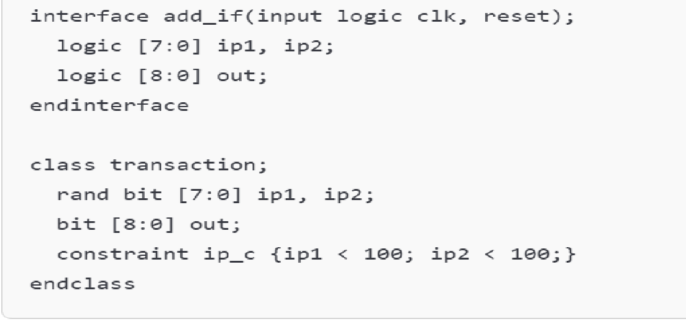
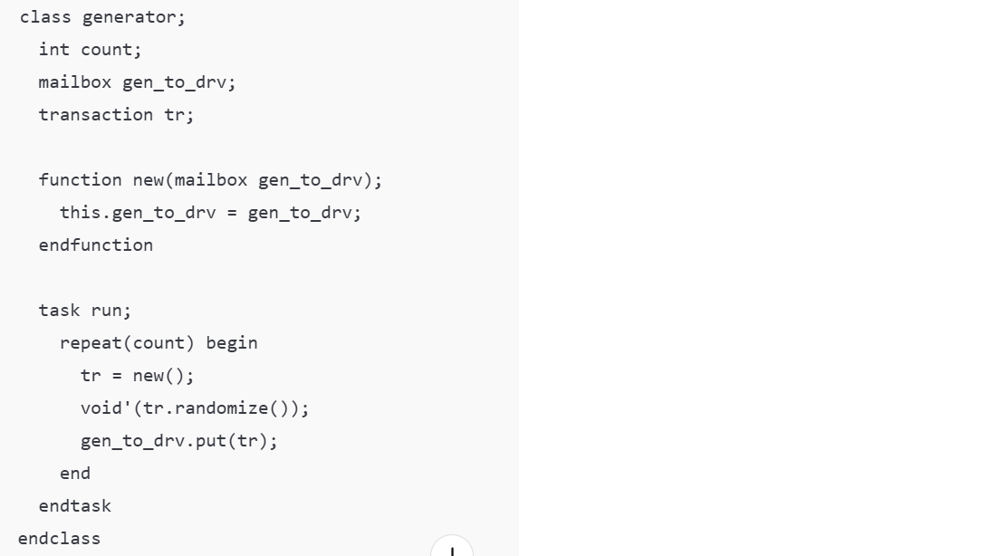
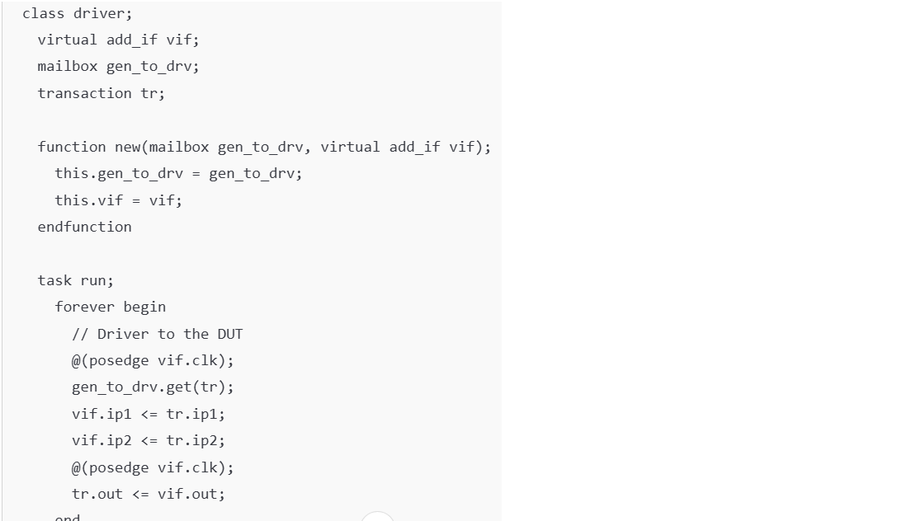
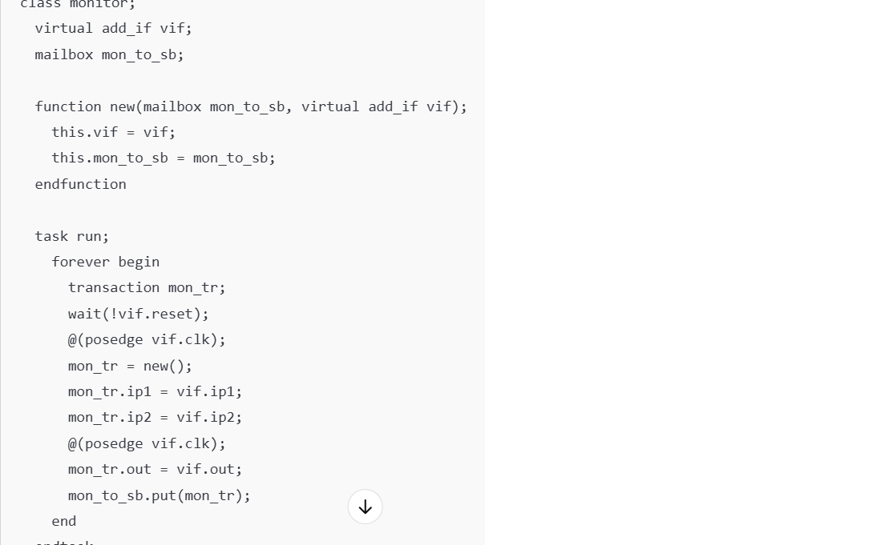
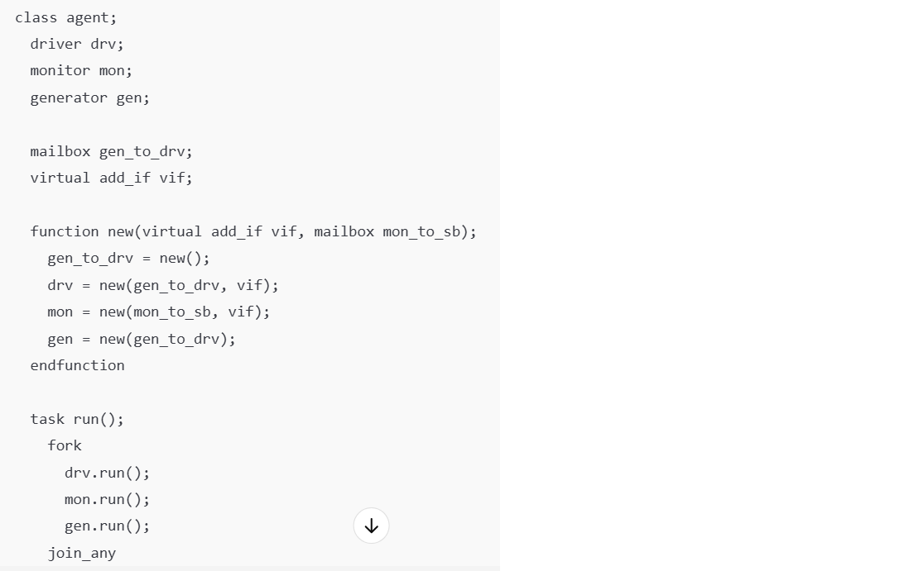
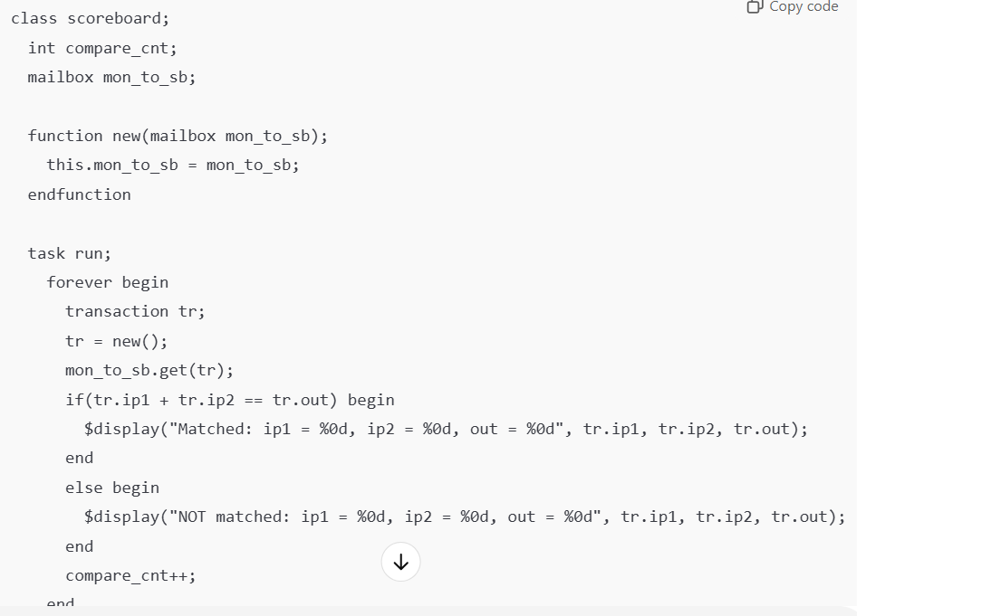
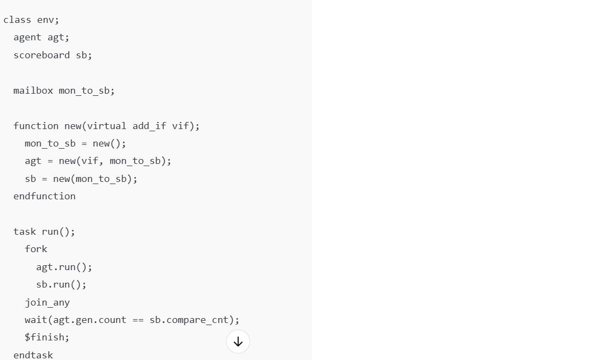
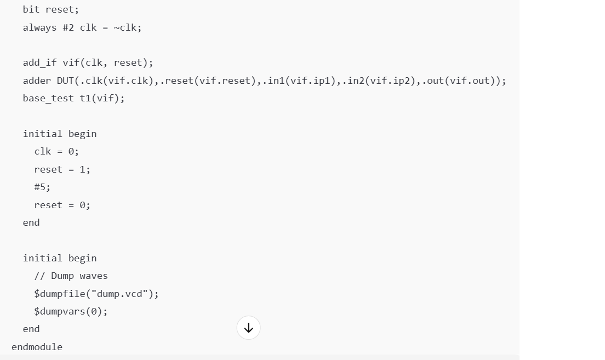

| **SystemVerilog Code Snippet** | **OOP Implementation Explanation** |
|-------------------------------|-------------------------------------|
|  | **Encapsulation & Randomization**: The `add_if` interface encapsulates signals `ip1`, `ip2`, and `out`, along with `clk` and `reset`, simplifying DUT connections by grouping related signals. The transaction class encapsulates inputs and outputs, along with constraints for randomization. Constrained random values for `ip1` and `ip2` support effective test coverage while maintaining data hiding within the class. |
|  | **Modularity**: The generator class is a self-contained module responsible for generating random transactions. It communicates with the driver through a mailbox. The class is reusable and easy to maintain, aligning with the principle of modular design. |
|  | **Abstraction**: The driver class abstracts the task of driving signals to the DUT. The users of this class do not need to understand the internal workings of the signal assignment, as it is encapsulated within the `run` task. |
|  | **Encapsulation**: The monitor class hides the internal monitoring logic and communicates with the scoreboard via a mailbox. The user interacts with the class by simply invoking the `run` task to start monitoring. |
|  | **Abstraction**: The agent class serves as an abstraction layer, combining the generator, driver, and monitor. It coordinates their interaction and abstracts away the complexities of managing these components individually. |
|  | **Modularity and Responsibility**: The scoreboard class is responsible for comparing the DUT’s outputs with the expected results, maintaining the principle of single responsibility for testing and verification. |
|  | **Constructor Usage**: The env class serves as the environment for the entire testbench, coordinating the generator, driver, monitor, and scoreboard. Its constructor initializes all necessary components. |
|  | **Concurrency**: The testbench leverages the `fork` and `join_any` constructs to run multiple tasks concurrently (generator, driver, and monitor), enabling parallelism in the verification process. |

## Summary
The testbench utilizes OOP principles primarily through encapsulation, modularity, and abstraction, creating a reusable and organized structure that enhances maintainability and scalability. These concepts simplify managing a complex verification environment by dividing responsibilities among classes, using tasks and functions to encapsulate operations, and making the testbench flexible for potential extensions or refinements.
